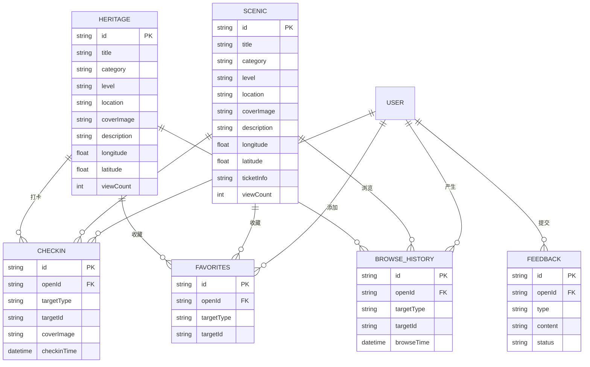

# 四川非遗文旅数字导览小程序 - ER 图

## Mermaid ER 图

将以下代码复制到 https://mermaid.live 或支持 Mermaid 的编辑器中渲染：

---

## 实体关系

| 实体 | 说明 | 关联 |
|:---|:---|:---|
| HERITAGE | 非遗数据 | 被打卡/收藏/浏览 |
| SCENIC | 景点数据 | 被打卡/收藏/浏览 |
| CHECKIN | 打卡记录 | 用户对景点/非遗的打卡 |
| FAVORITES | 收藏记录 | 用户收藏的景点/非遗 |
| BROWSE_HISTORY | 浏览历史 | 用户浏览记录 |
| FEEDBACK | 用户反馈 | 用户提交的反饋 |
